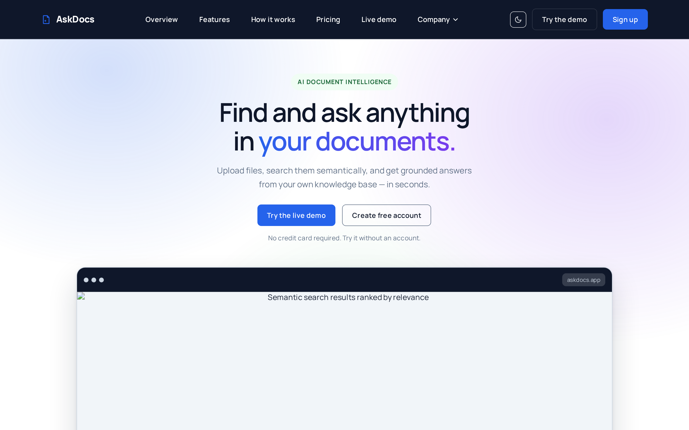
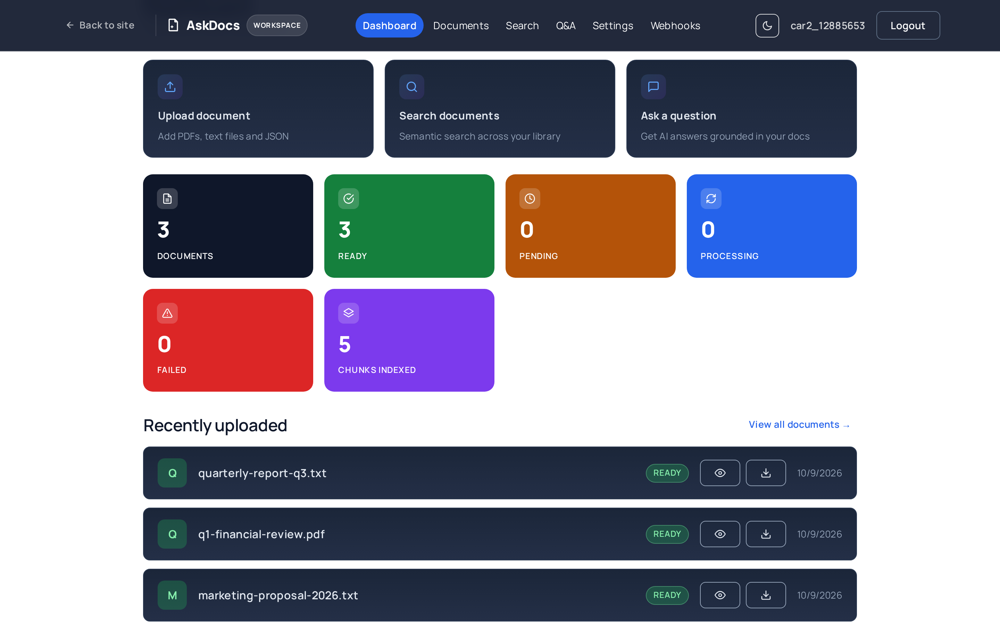
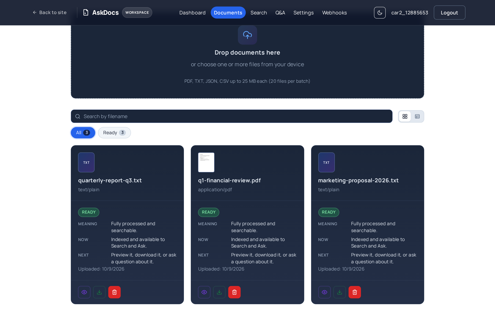
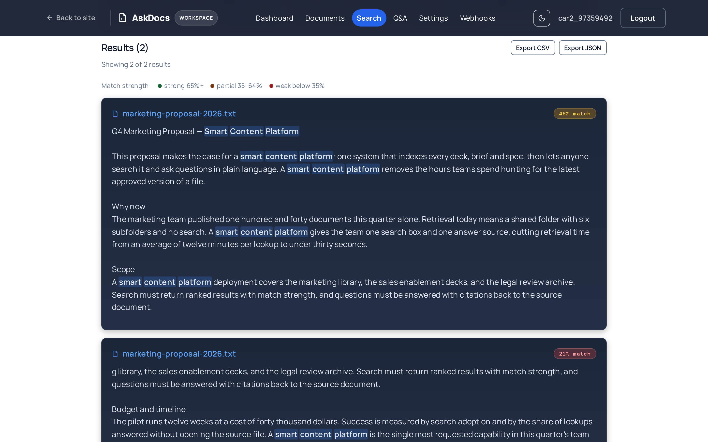
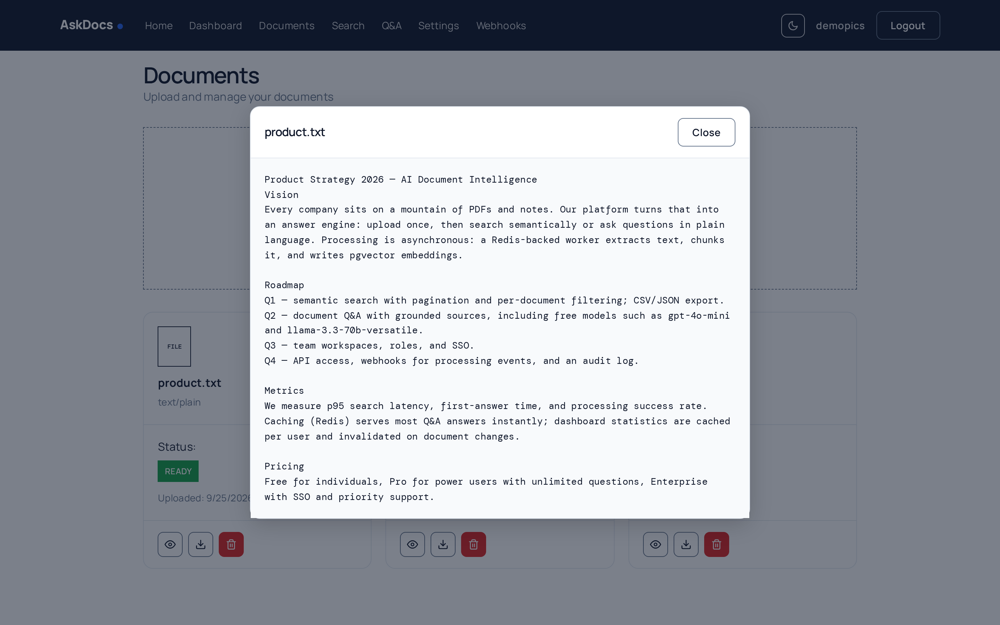

# AI Document Intelligence Platform

> Semantic search, chunking, embeddings, and grounded Q&A over your documents.

[](./backend/pyproject.toml) [](./frontend/package.json) [](https://fastapi.tiangolo.com/) [](https://react.dev/) [](./.github/workflows/ci.yml) [](./.github/workflows/infra.yml)

## Screenshots

<p align="center">
  
</p>

<p align="center">
  
  
  
  
</p>

## Purpose

This is a full-stack AI Document Intelligence Platform: upload documents, extract and split text, generate embeddings (OpenAI or local models), search semantically, and ask questions grounded in your documents with source context. Everything runs locally for development and is deployable to Kubernetes (Kustomize + Helm) for production.

## Tech Stack

**Backend**: Python 3.14, FastAPI 0.142.2, SQLAlchemy 2.1.3, PostgreSQL + pgvector, Redis + ARQ 0.28.0, MinIO/S3 (boto3), Alembic 1.19.2  
**Frontend**: React 19.3.0, TypeScript 7.0.2, Vite 8.3.0, TanStack Query, React Router 7.x  
**Infra**: Docker Compose (dev sandbox), Kustomize, Helm, Kind, cert-manager, ArgoCD (see [infra/](./infra))

## Prerequisites

- [Docker](https://docs.docker.com/get-docker/) and [Docker Compose](https://docs.docker.com/compose/)
- [Git](https://git-scm.com/)
- [mise](https://mise.jdx.dev/) (optional; tool versions in [mise.toml](./mise.toml))
- [`gh`](https://cli.github.com/) (used by workflow/agent conventions, optional for local run)

## Quick Start (Local)

```bash
git clone https://github.com/fiwon123/ai-document-platform.git
cd ai-document-platform

# One-time setup
make setup                # Host-native deps: uv sync + npm install

# Start dev sandbox: uvicorn + vite + arq worker + postgres + redis + minio
make dev-up               # Will build and start all services

# Follow logs (2nd terminal)
make dev-log

# Stop
make dev-down
```

Once started:
- Frontend: http://localhost:5175
- Backend API: http://localhost:8001 (docs at http://localhost:8001/docs)
- MinIO Console: http://localhost:9001 (minioadmin/minioadmin)

## Host-Native (No Sandbox)

```bash
# Start infra only
docker compose up -d postgres redis minio

# Backend (Python 3.14)
cd backend
uv sync
uv run alembic upgrade head
uv run uvicorn app.main:app --reload --host 0.0.0.0 --port 8000

# Frontend (Node 22)
cd frontend
npm install
npm run dev  # http://localhost:5173
```

## Project Structure

```
backend/       # FastAPI app (routes/services/repositories/models, alembic, tests)
frontend/      # React 19 + TypeScript + Vite SPA
infra/         # Dockerfiles, Kustomize, Helm, Kind smoke tests
docker-compose.yaml  # Dev sandbox (dev + worker + postgres + redis + minio)
Makefile       # Dev workflow (dev-up, infra-up, check, opencode, ...)
AGENTS.md      # Agent + workflow conventions
PROJECT_CONTEXT.md
DEVELOPMENT.md
```

## Testing & Quality

```bash
# Full gate (lint + format + tests + build)
make check

# Backend
cd backend && uv run pytest -v

# Frontend
cd frontend && npm run lint && npm run build && npm run test
```

## Deployment

See [infra/](./infra/) for multi-stage production Docker images (`backend`, `worker`, `frontend`), [Kustomize overlays](./infra/k8s/) (dev/production), and [Helm chart](./infra/helm/ai-platform/). Also includes [Kind cluster](./infra/kind/) and a smoke test under [infra/scripts](./infra/scripts/).

## AI & Attribution

**Portfolio project. AI-assisted development.** Third-party libraries used here retain their original authors' copyrights and licenses; refer to [`backend/uv.lock`](./backend/uv.lock) and [`frontend/package-lock.json`](./frontend/package-lock.json) for the exact dependencies and their license terms.

## License

This project is distributed under a **custom portfolio license**. See the [LICENSE](./LICENSE) file for details.