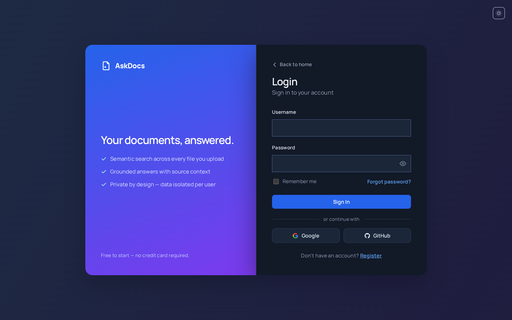
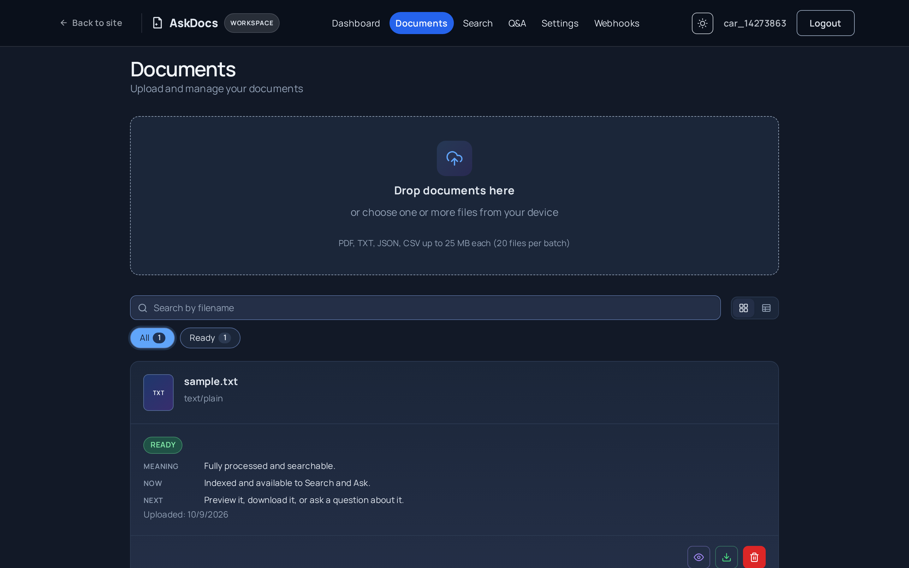
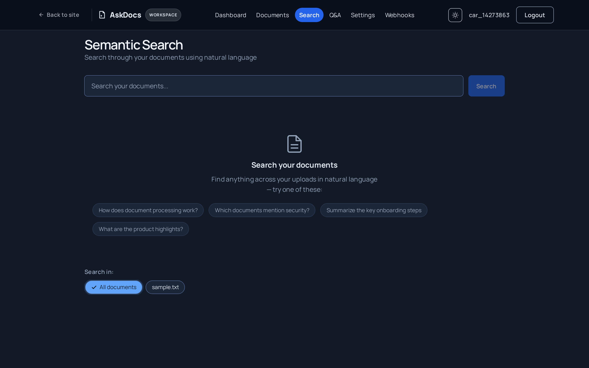

# AI Document Intelligence Platform

<p align="center">
  
</p>

> Upload documents, search semantically, and get grounded answers from your own knowledge base

[](https://www.python.org/downloads/)
[](https://nodejs.org/)
[](https://fastapi.tiangolo.com/)
[](https://react.dev/)
[](.github/workflows/ci.yml)
[](.github/workflows/ci.yml)
[](.github/workflows/infra.yml)
[](LICENSE)

## Table of Contents

- [Home Page](#home-page)
- [Purpose](#purpose)
- [Features](#features)
- [Screenshots](#screenshots)
- [Tech Stack](#tech-stack)
- [Prerequisites](#prerequisites)
- [Quick Start (Local)](#quick-start-local)
- [Host-Native (No Sandbox)](#host-native-no-sandbox)
- [Project Structure](#project-structure)
- [Testing & Quality](#testing--quality)
- [Deployment](#deployment)
- [Credits](#credits)
- [AI & Attribution](#ai--attribution)
- [License](#license)

## Home Page

<p align="center">
  
</p>

**AI Document Intelligence Platform** — Upload documents, extract and chunk text, generate embeddings (OpenAI or local models), search semantically with pgvector, and ask questions grounded in your documents with source attribution. Runs locally via Docker Compose; deployable to Kubernetes (Kustomize + Helm) for production.

Key capabilities: document upload/bulk upload, async processing, semantic & keyword search, Q&A with citations, PDF thumbnails/preview, JWT auth with refresh rotation, semantic caching, webhooks, admin dashboard, rate limiting.

## Purpose

This is a full-stack AI Document Intelligence Platform: upload documents, extract and split text, generate embeddings (OpenAI or local models), search semantically, and ask questions grounded in your documents with source context. Everything runs locally for development and is deployable to Kubernetes (Kustomize + Helm) for production.

## Features

- **Document Upload**: Upload single or bulk documents (PDF, TXT, JSON, CSV up to 25MB)
- **Asynchronous Processing**: Text extraction, chunking, and embedding generation in background workers
- **Semantic Search**: pgvector-powered similarity search with keyword fallback when embeddings unavailable
- **Q&A with Sources**: Grounded answers with source attribution across your documents
- **Thumbnails & Preview**: PDF first-page thumbnails and extracted text preview
- **Secure Auth**: JWT authentication with rotating refresh tokens
- **Caching**: Semantic caching for QA and dashboard statistics
- **Webhooks**: Event notifications for document processing lifecycle
- **Admin Controls**: User management, system statistics, and role-based access
- **Rate Limiting & CORS**: Built-in protection with Redis-backed rate limiting

## Screenshots

### 1. Dashboard — Your Workspace at a Glance
<p align="center">
  
</p>
Get an instant overview with document counts by status, recent uploads, and quick access to your most recent activity.

### 2. Documents — Upload & Manage
<p align="center">
  
</p>
Upload single or bulk files, drag-and-drop support, track processing status in real-time, and preview or download processed documents.

### 3. Search — Semantic Search Across Your Files
<p align="center">
  
</p>
Find exactly what you're looking for with vector-based semantic search. Results are ranked by relevance with match percentages, exportable as CSV or JSON.

### 4. Preview — Read Extracted Content Instantly
<p align="center">
  
</p>
Instantly preview extracted text from processed documents with clean formatting and full scrollable content view.

## Tech Stack

| Layer | Technology | Version | Purpose |
|---|---|---|---|
| Frontend | React, TypeScript, Vite | React 19, TS 5.x, Vite 8 | SPA with TypeScript |
| Backend | FastAPI, Python | Python 3.14 | REST API |
| Database | PostgreSQL + pgvector | 15+ | Relational + vector search |
| Cache/Queue | Redis | 7+ | Caching & background jobs (ARQ) |
| Storage | MinIO/S3 | Compatible | Object storage |
| Auth | JWT (HS256) | - | Authentication with refresh rotation |
| AI | OpenAI, Groq, Ollama | Configurable | Embeddings & Q&A |
| Infrastructure | Docker, Kubernetes, Helm | - | Containerization & deployment

## Prerequisites

- Docker & Docker Compose
- Git
- Make (optional, but recommended)
- `uv` for backend deps (handled in sandbox)
- `node` 22+ for frontend (handled in sandbox)

## Quick Start (Local)

```bash
# Clone the repository
git clone https://github.com/fiwon123/ai-document-platform.git
cd ai-document-platform

# Start the full dev sandbox (dev + worker + infra)
make dev-up

# View logs (2nd terminal)
make dev-log
```

Access:
- Frontend: http://localhost:5175
- Backend API: http://localhost:8001
- API Docs: http://localhost:8001/docs
- MinIO Console: http://localhost:9001 (minioadmin/minioadmin)

Stop:
```bash
make dev-down
```

## Host-Native (No Sandbox)

```bash
# Start infrastructure
docker compose up -d postgres redis minio

# Backend
cd backend
uv sync
uv run alembic upgrade head
uv run uvicorn app.main:app --reload --host 0.0.0.0 --port 8000

# Frontend (separate terminal)
cd frontend
npm install
npm run dev
```

## Project Structure

```
├── backend/       # FastAPI app, SQLAlchemy models, routes, services
├── frontend/      # React 19 + TypeScript + Vite SPA
├── infra/         # K8s (Kustomize + Helm), Docker images, scripts
├── docker-compose.yaml  # Dev sandbox
├── Makefile       # Dev workflow targets
└── README.md
```

## Testing & Quality

```bash
# Backend tests
cd backend && uv run pytest

# Backend lint
cd backend && uv run ruff check src/

# Frontend lint & build
cd frontend && npm run lint && npm run build

# Full check (lint + format + tests + build)
make check
```

## Deployment

Production-ready deployment with multi-stage Docker images, Kubernetes manifests, and Helm charts. See:
- [Kustomize](./infra/k8s/) - Base + dev/production overlays
- [Helm](./infra/helm/ai-platform/) - Standalone chart
- [Docker Images](./infra/docker/) - Multi-stage builds
- [CI/CD](./.github/workflows/) - GitHub Actions

## Credits

- [FastAPI](https://fastapi.tiangolo.com/) — High-performance web framework
- [React 19](https://react.dev/) — UI framework
- [pgvector](https://github.com/pgvector/pgvector) — Vector similarity search for PostgreSQL
- [ARQ](https://arq-docs.helpmanual.io/) — Redis-based async task queue
- [MinIO](https://min.io/) — S3-compatible object storage
- [Playwright](https://playwright.dev/) — End-to-end testing & visual captures

## AI & Attribution

This is a portfolio project. AI-assisted development helped accelerate iteration, but all architectural decisions and code are actively curated.  

## License

Custom License — see [LICENSE](LICENSE) for details.
