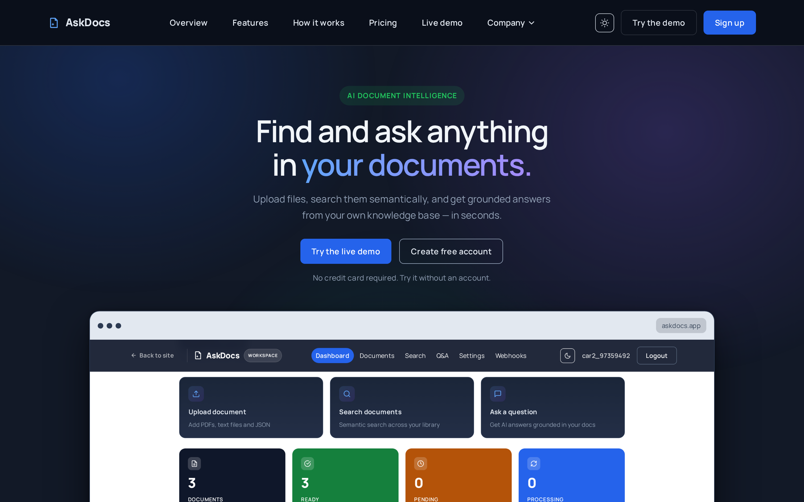

## Purpose

This is a full-stack AI Document Intelligence Platform: upload documents, extract and split text, generate embeddings (OpenAI or local models), search semantically, and ask questions grounded in your documents with source context. Everything runs locally for development and is deployable to Kubernetes (Kustomize + Helm) for production.

Table of Contents

- [Purpose](#purpose)
- [Hero](#hero)
- [Features](#features)
- [Screenshots](#screenshots)
- [Tech Stack](#tech-stack)
- [Prerequisites](#prerequisites)
- [Quick Start (Local)](#quick-start-local)
- [Host-Native (No Sandbox)](#host-native-no-sandbox)
- [Project Structure](#project-structure)
- [Testing & Quality](#testing--quality)
- [Deployment](#deployment)
- [Credits](#credits)
- [AI & Attribution](#ai--attribution)
- [License](#license)

## Hero

  

## Features

- **Document Upload**: Upload single or bulk documents (PDF, TXT, JSON, CSV up to 25MB)
- **Asynchronous Processing**: Text extraction, chunking, and embedding generation in background workers
- **Semantic Search**: pgvector-powered similarity search with keyword fallback when embeddings unavailable
- **Q&A with Sources**: Grounded answers with source attribution across your documents
- **Thumbnails & Preview**: PDF first-page thumbnails and extracted text preview
- **Secure Auth**: JWT authentication with rotating refresh tokens
- **Caching**: Semantic caching for QA and dashboard statistics
- **Webhooks**: Event notifications for document processing lifecycle

## 